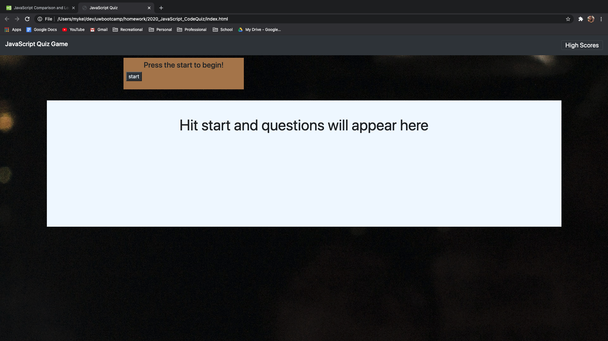
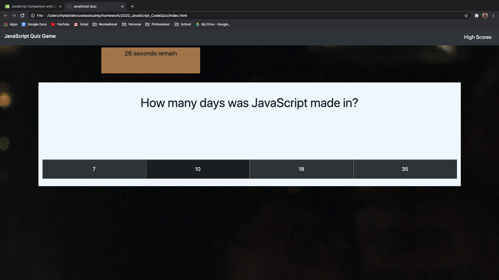
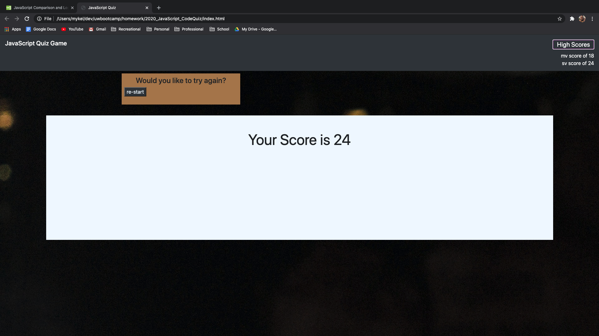

# 2020_JavaScript_CodeQuiz
Test your knowledge on the latest JavaScript, can you beat the high score?

----

## Links

link to the launched site here [site](https://valadezmykel.github.io/2020_JavaScript_CodeQuiz/)

link to the repository here [repo](https://github.com/valadezMykel/2020_JavaScript_CodeQuiz)

----

## About

This program deploys a JavaScript quiz that you can take to refine your knowledge of JavaScript.

You'll have a time limit to answer each question as they appear

Once you have completed the game you can then save your score

----

## Usage 

Use this cite to practice your JavaScript, or clone the repo from github and use it to fill out your own questions to practice

## API

any web browser can run this code

## Installation

Clink [here](https://valadezmykel.github.io/2020_JavaScript_CodeQuiz/) to use the site without installing 

or go to the github repo [here](https://github.com/valadezMykel/2020_JavaScript_CodeQuiz)

## License

No license applied

